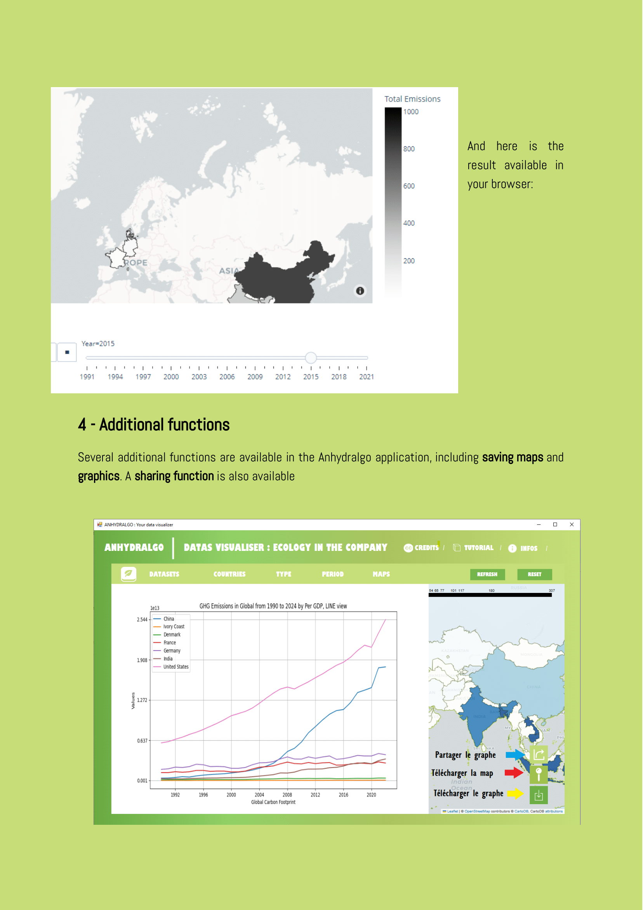

# anhydralgo
## Project with 4 collaborators carried out for the BUT Informatique at the end of the first year.

## Table of Contents
- [Introduction](#introduction)
- [Features](#features)
- [DataBase diagram](#database-diagram)
- [Technologies Used](#technologies-used)
- [Usage](#usage)

## Introduction
 We realised a software that generates interactive maps and graphs of CO2 emissions from a database filled with csvs from an official database

## Features 
### ➢ Interactive maps.
 * Creating maps that evolve over time. 
 * Creation of fixed maps with several layers. 
### ➢ View graphs and statistics. 
 *  A wide range of graphs can be displayed.
 * Choice of employment period.
 * Choice of data set used. 
 * You can choose which countries are selected.
### ➢ Sharing generated graphics.
### ➢ Saving generated graphics.
### ➢ Saving generated maps.

## Technologies used
   

## DataBase diagram

## Usage

